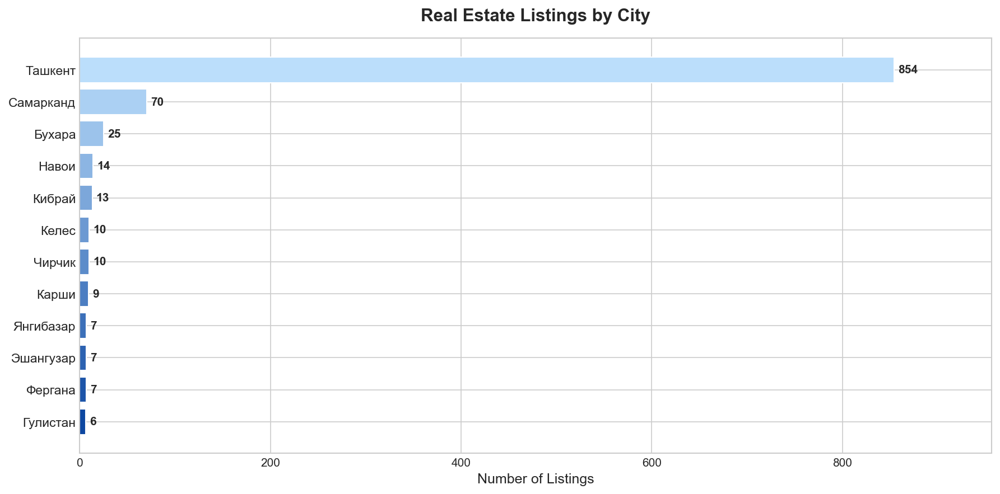
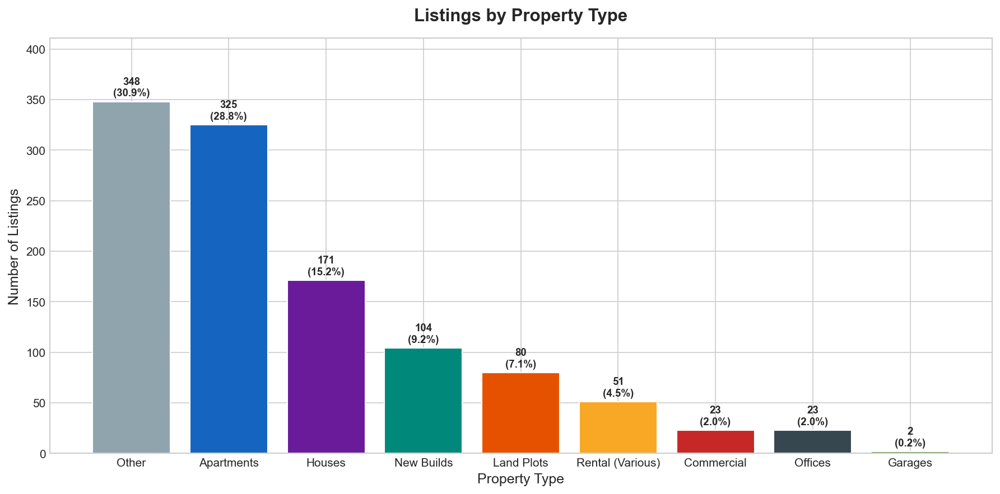
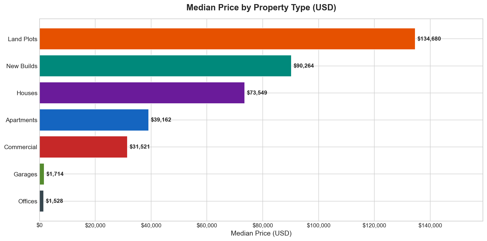
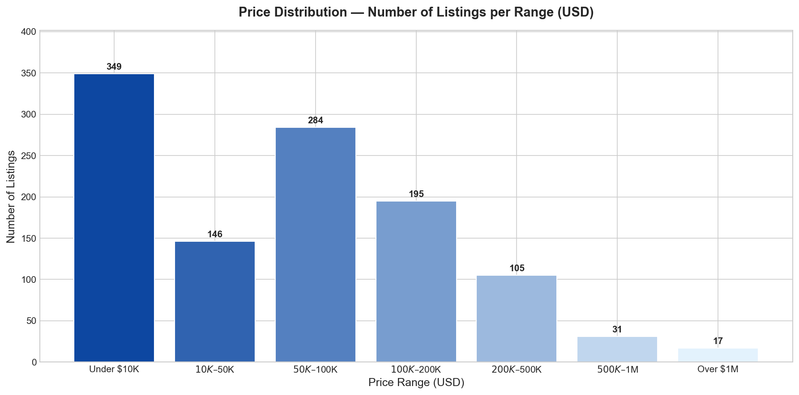
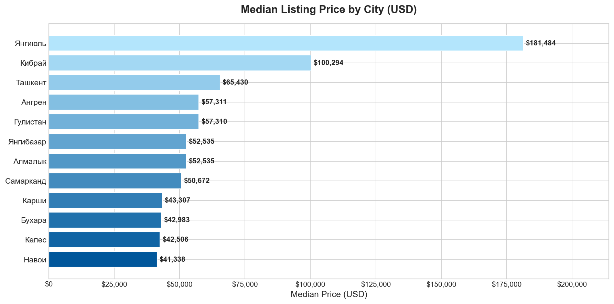
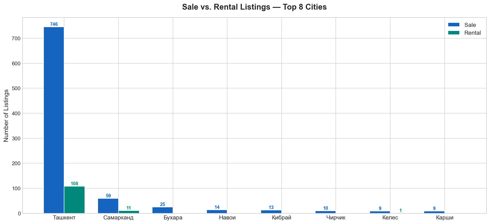
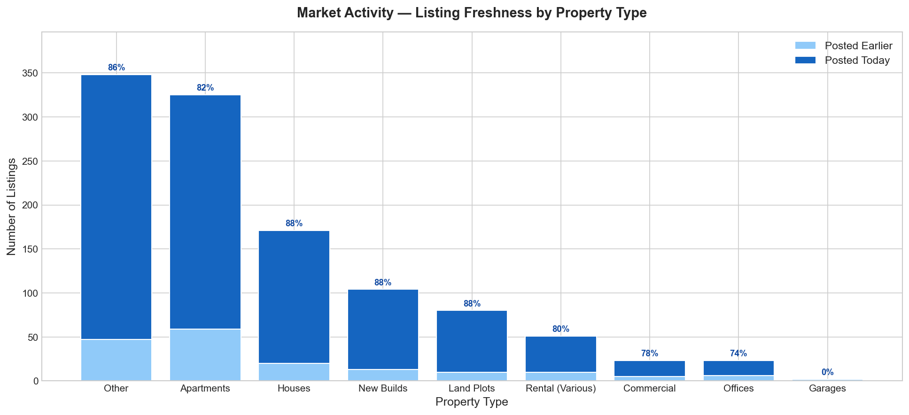

# Uzbekistan Real Estate Market — Executive Intelligence Report

- **Source:** OLX.uz — Uzbekistan's largest property marketplace
- **Listings Analyzed:** 1,127 active listings (filtered for validity)
- **Snapshot Date:** March 8, 2026
- **Currency:** All prices converted to USD at 12,700 UZS/USD

---

## Market at a Glance

| Metric | Value |
|---|---|
| Total Active Listings | 1,127 |
| For Sale | 1,003 (89%) |
| For Rent | 124 (11%) |
| Posted Today | 955 (84%) |
| Median Listing Price | ~$59,000 |
| Price Range | $790 — $3,340,000 |

---

## Finding 1 — The Market Is Overwhelmingly Concentrated in Tashkent

**75.8% of all listings (854 out of 1,127) are located in Tashkent.** Samarkand is a distant second with 70 listings (6.2%), followed by Bukhara (25) and Namangan (14). Every other city accounts for fewer than 15 listings each.

**What this means:**
- Tashkent is not just the capital — it is effectively the entire formal real estate market in Uzbekistan, at least on digital platforms.
- Businesses targeting national real estate exposure via OLX get 76% Tashkent coverage by default.
- Regional cities represent an underserved, low-competition opportunity. Samarkand, Bukhara, and Fergana are emerging digital markets worth early investment in listings, advertising, or partnerships.
- Any platform, agency, or proptech company should treat Tashkent and "the rest of Uzbekistan" as two separate market strategies.

---

## Finding 2 — Apartments Lead, But a Third of Listings Lack Clear Classification

Apartments are the dominant property type (28.8%), followed by New Builds (9.2%), Houses (8.4%), and Land Plots (7.5%). However, **36.8% of listings fall into an "Other" category** — meaning sellers did not use standardized listing formats, making it difficult for buyers to find their property.

**What this means:**
- The apartment segment is the primary battleground — highest volume, most competitive.
- New builds (off-plan / under construction) represent a sizable and growing segment, indicating active developer activity in Uzbekistan.
- The high share of unclassified listings signals a significant data quality problem on the platform. Agencies and developers who invest in proper listing structure gain immediate visibility advantages over unclassified competitors.
- Land plot and house segments are under-digitized relative to their real-world market size — opportunity for specialized agents.

---

## Finding 3 — Land and Houses Carry the Highest Price Tags; Apartments Are the Most Accessible

| Property Type | Median Price (USD) |
|---|---|
| Land Plots | $133,725 |
| Houses | $114,621 |
| New Builds | $90,742 |
| Apartments | $39,162 |
| Commercial | $31,520 |

Land plots command the highest median prices — reflecting the scarcity of well-located developable land in Uzbekistan's urbanizing landscape. New builds sit 2.3× above existing apartments in median price, reflecting premium pricing for modern construction.

**What this means:**
- The land and house segments are dominated by high-value, low-frequency transactions — suited for specialized agencies with high-touch service models.
- Apartments at $39K median are the entry point for most buyers and represent the highest transaction volume opportunity.
- New build pricing at $90K suggests developers are targeting an emerging middle class with purchasing power above the general market median.
- Commercial real estate at $31K median is surprisingly affordable — potential signal of an oversupplied or underpromoted commercial segment.

---

## Finding 4 — The Sweet Spot Is $50K–$100K, But One-Third of Listings Are Under $10K

The market splits into two clear zones:

**Low-end zone (Under $10K): 349 listings (31%)** — Dominated by rentals, garages, small offices, and daily/weekly lets. This is a high-volume, low-margin segment.

**Mid-market zone ($50K–$200K): 479 listings (42.5%)** — The primary property purchase zone, split between:
- $50K–$100K: 284 listings (the single largest price bucket)
- $100K–$200K: 195 listings

**Premium zone ($200K+): 153 listings (13.6%)** — Houses, large land plots, premium apartments, and commercial complexes.

**What this means:**
- The $50K–$100K bracket is the most competitive price band — buyers, sellers, and agents should invest most attention here.
- The under-$10K cluster, while large in count, generates limited revenue per transaction. Businesses should evaluate whether volume in this segment justifies operational costs.
- The thin supply above $500K (48 listings total) means the premium segment has limited price discovery — high-value sellers face less competition but also smaller buyer pools.
- Mortgage and financing products designed for the $50K–$200K bracket would address the largest addressable buyer market.

---

## Finding 5 — Bukhara Commands Premium Prices Despite Low Volume

| City | Median Price | Listings |
|---|---|---|
| Bukhara | $100,294 | 25 |
| Tashkent | $65,907 | 854 |
| Fergana | $57,310 | 13 |
| Samarkand | $51,197 | 70 |
| Namangan | $43,307 | 14 |

Bukhara's median price of $100K is **52% higher than Tashkent** despite having only 25 listings — the highest price-to-volume ratio of any major city. This likely reflects a mix of tourism-driven premium valuations (Bukhara is a UNESCO heritage city) and low supply inflating median prices.

**What this means:**
- Bukhara represents a niche premium market — high prices, low competition, likely driven by tourism investment and international buyer interest.
- Tashkent's $66K median confirms its role as the mass-market capital with the most balanced supply and demand dynamics.
- Samarkand at $51K with 70 listings shows growing regional formalization — a city to watch as tourism and investment infrastructure improves.
- Regional cities below Samarkand in both price and volume suggest underdeveloped local economies with limited formal real estate activity.

---

## Finding 6 — Rental Supply Is Almost Entirely a Tashkent Story

Of the 124 rental listings across all of Uzbekistan, the overwhelming majority are in Tashkent. Regional cities show near-zero formal rental supply on the platform — despite presumably having local rental activity happening off-platform or through informal channels.

**What this means:**
- The rental market outside Tashkent is almost entirely invisible online. This is both a market failure and an opportunity — platforms, agencies, or apps that capture regional rental demand would face little existing competition.
- Investors considering rental yield strategies should focus exclusively on Tashkent, where both supply and demand signals exist.
- High sale-to-rental ratio (89:11) nationally suggests the market remains primarily owner-occupier driven — typical of developing economies transitioning toward homeownership.

---

## Finding 7 — The Market Is Highly Active, With 84% of Listings Posted Today

84% of all listings (955 out of 1,127) were posted on the day of data capture — an unusually high freshness rate. This is consistent across all property types. Across the entire market, only 16% of listings are from prior days.

**What this means:**
- OLX.uz operates with aggressive listing renewal behavior — sellers frequently re-post or refresh their listings to stay visible at the top of search results. The apparent "freshness" is partly a platform mechanics artifact, not purely new supply entering the market.
- For buyers, this means the effective choice set at any given moment is actually much smaller than 1,127 unique properties — many are the same properties re-listed repeatedly.
- For platform operators and competitors: listing freshness inflation may reduce trust and buyer experience. Platforms that implement unique-listing enforcement or de-duplication would offer a differentiated buyer experience.
- For analysts: snapshot datasets from OLX may overcount the number of distinct properties in the market by 30–50%, requiring time-series tracking to distinguish new supply from re-listed inventory.

---

## Strategic Recommendations

### For Real Estate Agencies
1. **Double down on Tashkent's $50K–$100K apartment segment** — highest buyer demand, highest transaction frequency.
2. **Build a regional presence in Samarkand and Bukhara** — low competition, premium pricing potential, tourism-linked demand.
3. **Invest in listing quality** — over a third of listings are unclassified. Well-structured listings gain disproportionate visibility.

### For Developers
4. **The new build segment commands a 2.3× price premium over existing apartments** — there is strong evidence of buyer appetite for modern construction in Uzbekistan.
5. **Land scarcity is real** — land plots carry the highest median prices of any category. Developers who secure land now are positioned ahead of the affordability curve.

### For Investors
6. **Rental yields are concentrated in Tashkent** — regional rental markets are effectively off-platform and unquantifiable from this data.
7. **The premium segment ($500K+) is thin** — 48 listings nationally means limited comparable sales data and high pricing uncertainty.

### For Platform / Proptech Operators
8. **Listing de-duplication is a major UX opportunity** — the 84% same-day posting rate suggests significant re-listing noise that degrades buyer experience.
9. **Regional expansion is the white space** — 11 cities have fewer than 10 listings each, despite representing millions of residents.

---

*Analysis based on 1,127 OLX.uz real estate listings captured on March 8, 2026. Prices converted at 12,700 UZS/USD. Properties priced below $79 (1,000,000 UZS) were excluded as likely test or erroneous entries.*
