# 📊 Azerbaijan Health Statistics Analysis
## Disease Trends Over 34 Years (1990-2024)

---

## 🎯 Executive Summary

This comprehensive analysis examines **health trends in Azerbaijan** from 1990 to 2024, revealing critical insights about disease patterns, cancer incidence, and public health evolution over more than three decades.

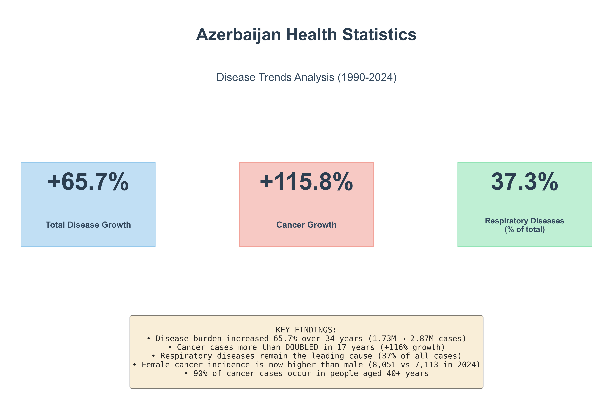

---

## 📈 The Big Picture: Overall Disease Burden

### Total Disease Cases Continue to Rise

Over the past 34 years, Azerbaijan has experienced a **65.7% increase** in total disease burden, rising from **1.73 million cases** in 1990 to **2.87 million cases** in 2024.

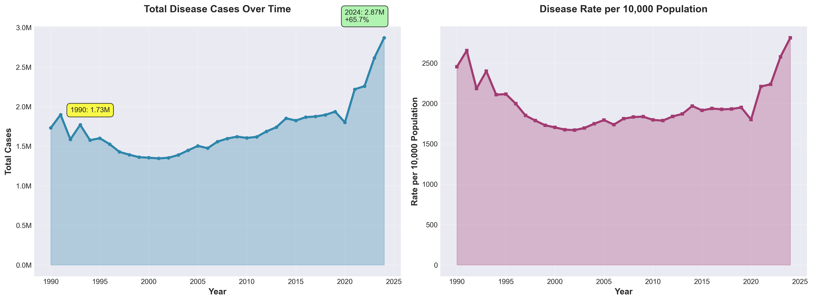

**Key Observations:**
- **Steady Growth**: Disease cases have grown consistently, with notable acceleration in recent years
- **Per Capita Rate**: While absolute numbers increased, the rate per 10,000 population shows more moderate growth
- **Population Factor**: Part of the increase reflects population growth and improved disease detection

---

## 🏥 What's Making People Sick? Top Disease Categories

### The Leaders in 2024

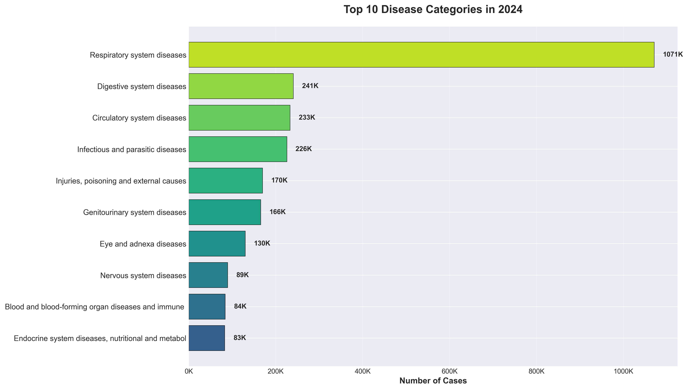

The disease landscape in Azerbaijan is dominated by:

1. **Respiratory Diseases** - 1.07M cases (37% of all diseases)
2. **Digestive Diseases** - 241K cases
3. **Circulatory Diseases** - 233K cases
4. **Infectious & Parasitic Diseases** - 226K cases
5. **Injuries & External Causes** - 170K cases

> **💡 Insight:** Respiratory diseases alone account for more than one-third of all registered cases, highlighting a critical public health priority.

---

## 📊 How Disease Patterns Changed Over Time

### Evolution of Major Disease Categories (1990-2024)

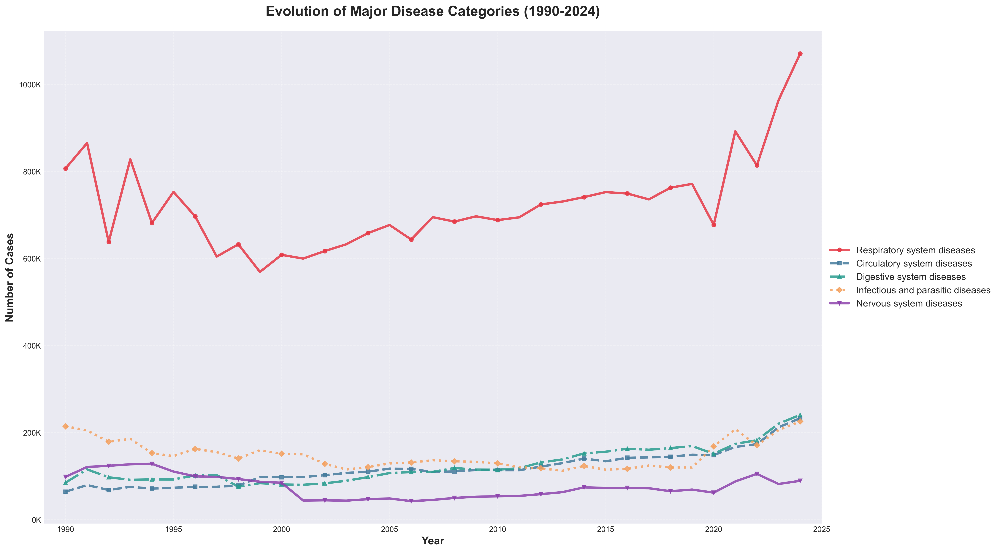

**Trends That Stand Out:**
- **Respiratory diseases** remain consistently dominant throughout the entire period
- **Circulatory diseases** show significant growth, tripling from 64K to 233K cases
- **Digestive diseases** nearly tripled from 85K to 241K cases
- **Infectious diseases** remained relatively stable, hovering around 200K cases

---

## 🔄 Then vs Now: Disease Distribution Comparison

### How the Health Landscape Shifted

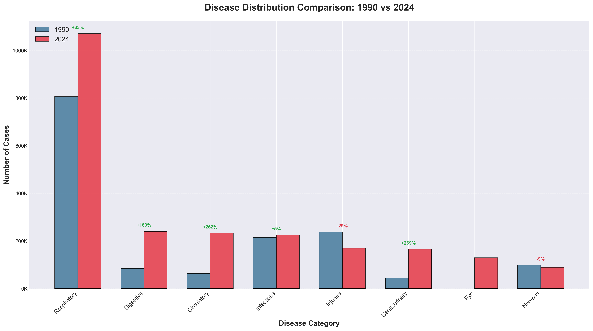

**1990 vs 2024:**
- Respiratory diseases maintained their dominance (46.6% → 37.3%)
- Other disease categories gained larger shares as the health system improved detection
- More diverse disease pattern in 2024 reflects better diagnostic capabilities

---

## 📉📈 Winners and Losers: Growth Rates by Category

### Which Diseases Grew the Fastest?

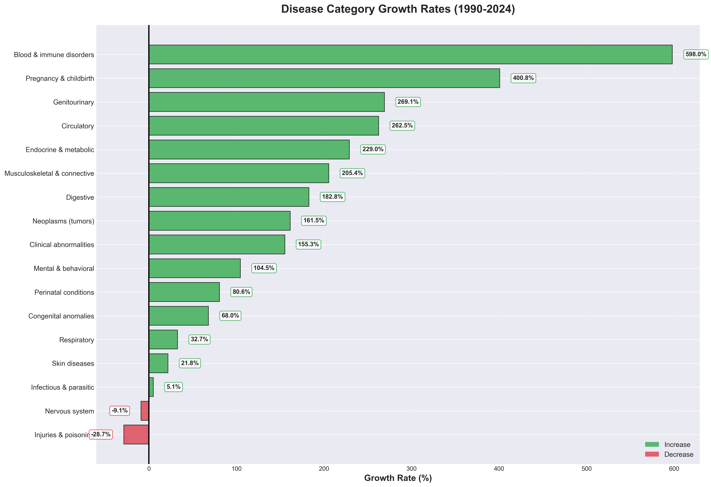

**Fastest Growing Categories (1990-2024):**
- **Circulatory diseases**: +263% 🚨
- **Digestive diseases**: +183%
- **Eye diseases**: +149%
- **Endocrine disorders**: +229%

**Declining Categories:**
- **Mental & behavioral disorders**: -72%
- **Nervous system diseases**: -9%
- **Infectious diseases**: +5% (nearly stable)

> **💡 Insight:** The dramatic rise in circulatory and digestive diseases suggests lifestyle and demographic changes are reshaping Azerbaijan's health challenges.

---

## 🎗️ Cancer: A Growing Concern

### The Numbers Tell a Serious Story

Between 2007 and 2024, cancer cases in Azerbaijan **more than doubled**, increasing by **116%**.

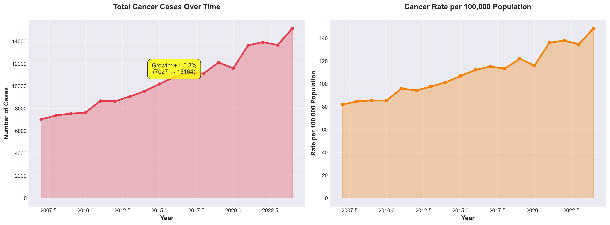

**The Cancer Crisis:**
- **2007**: 7,027 new cancer cases
- **2024**: 15,164 new cancer cases
- **Rate**: Increased from 82 to 149 cases per 100,000 population

This represents one of the **fastest-growing health challenges** in the country.

---

## 👥 Cancer Doesn't Discriminate, But Shows Patterns

### Gender Analysis Reveals Important Trends

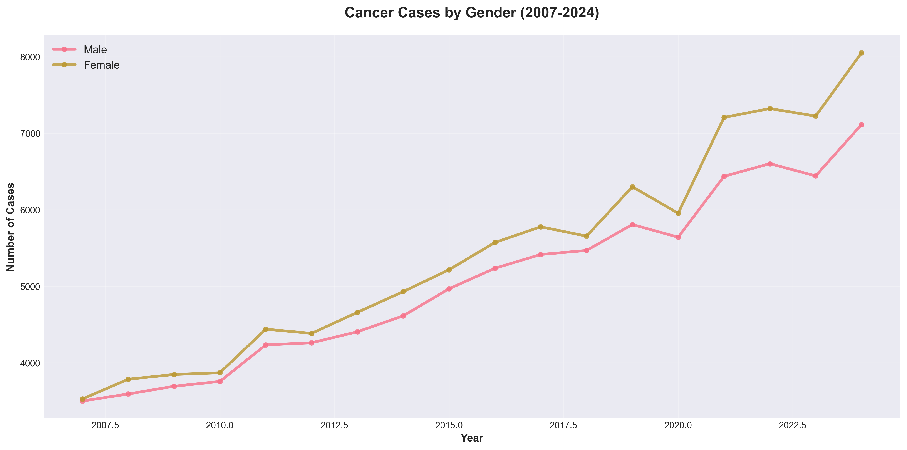

**Key Findings:**
- **Female cases surpassed male cases** in recent years
- **2024**: 8,051 female cases vs 7,113 male cases
- **Female growth**: +128% (2007-2024)
- **Male growth**: +103% (2007-2024)

> **💡 Insight:** The higher growth rate in female cancer cases may reflect improved screening, breast cancer prevalence, or other gender-specific risk factors.

---

## 👴 Age Matters: Cancer Risk Increases Dramatically

### Where Cancer Strikes Most

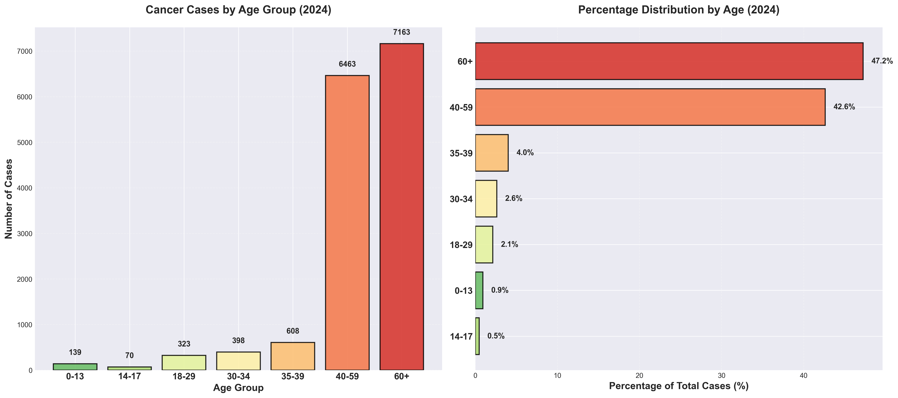

**The Age Factor (2024 Data):**
- **60+ age group**: 7,163 cases (47.2% of all cancers)
- **40-59 age group**: 6,463 cases (42.6%)
- **Combined 40+**: Nearly **90% of all cancer cases**

**Younger populations:**
- Under 18 years: Only 1.4% of cases
- 18-39 years: 8.8% of cases

> **💡 Insight:** Cancer in Azerbaijan is predominantly a disease of middle and older age, with the risk sharply increasing after age 40.

---

## 🔍 The Complete Picture: Age and Gender Combined

### Who Gets Cancer When?

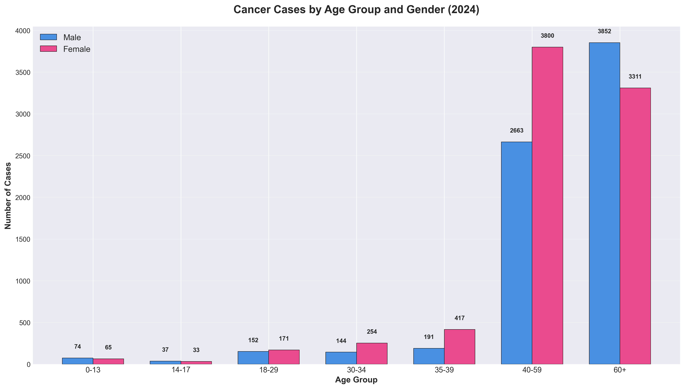

**Pattern Recognition:**
- **Gender gap widens with age**: Female predominance is strongest in 35-59 age range
- **Elderly males**: Highest absolute numbers in 60+ category
- **Youth impact**: Very low but similar across genders in younger ages

---

## 🌡️ Heat Map: Tracking Cancer Rates Across Time and Age

### Intensity of Cancer Incidence

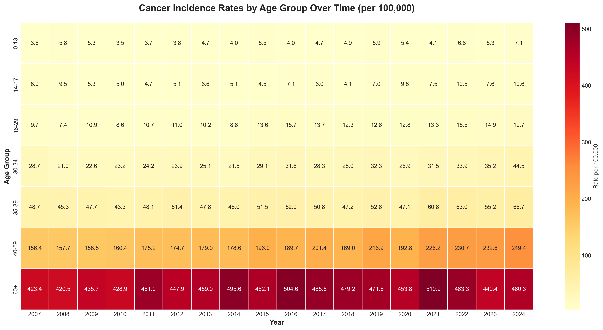

**What the Heat Map Shows:**
- **Darkest red** (highest rates): Elderly population (60+), especially in recent years
- **Progressive intensification**: Rates increasing across all age groups over time
- **Age gradient**: Clear progression from low rates in youth to high rates in elderly
- **2020 anomaly**: Slight dip likely due to COVID-19 pandemic disruptions

> **💡 Insight:** The elderly face cancer rates up to **460 per 100,000** - nearly **7 times higher** than the overall population average.

---

## 🎯 Key Takeaways

### What This Data Tells Us

1. **Disease Burden is Growing**
   - Total cases increased 66% over 34 years
   - Growth driven by population expansion and better detection

2. **Respiratory Diseases Dominate**
   - Account for 37% of all diseases
   - Consistent leader throughout entire study period

3. **Lifestyle Diseases Surging**
   - Circulatory diseases: +263%
   - Digestive diseases: +183%
   - Suggests changing lifestyle patterns

4. **Cancer Crisis Accelerating**
   - Doubled in 17 years (+116%)
   - Faster growth than overall disease burden

5. **Age is the Biggest Cancer Risk**
   - 90% of cases occur in people 40+
   - Risk increases exponentially with age

6. **Gender Patterns Emerging**
   - Female cancer cases now exceed male
   - Different risk profiles across age groups

---

## 🏗️ Project Structure

```
diseases_analyse/
├── data/
│   ├── 001_2_1.xls                                          # Original disease data
│   ├── 001_2_8.xls                                          # Original cancer data
│   ├── normalized_population_morbidity_by_disease.csv       # Cleaned disease data
│   └── normalized_malignant_neoplasms_by_age_gender.csv    # Cleaned cancer data
├── charts/                                                  # All generated visualizations
│   ├── 01_overall_disease_burden.png
│   ├── 02_top_diseases_2024.png
│   ├── 03_major_diseases_evolution.png
│   ├── 04_disease_distribution_comparison.png
│   ├── 05_disease_growth_rates.png
│   ├── 06_cancer_incidence_trend.png
│   ├── 07_cancer_by_gender.png
│   ├── 08_cancer_age_distribution.png
│   ├── 09_cancer_age_gender.png
│   ├── 10_cancer_rates_heatmap.png
│   └── 11_key_insights_dashboard.png
├── scripts/
│   ├── normalize_datasets.py                                # Data cleaning script
│   ├── generate_charts.py                                   # Visualization generator
│   └── example_analysis.py                                  # Example queries
└── README.md                                                # This presentation
```

---

## 🔄 Reproducing This Analysis

### Generate All Charts
```bash
python3 scripts/generate_charts.py
```

### Normalize Raw Data
```bash
python3 scripts/normalize_datasets.py
```

### Run Example Analyses
```bash
python3 scripts/example_analysis.py
```

---

## 📊 Data Structure

### Dataset 1: Population Morbidity by Disease Classification
**Time Period:** 1990-2024 (35 years)
**Records:** 1,400
**Coverage:** 19 disease categories

**Key Columns:**
- `year` - Year of record
- `disease_category` - Disease classification
- `metric_type` - Absolute cases or rate per 10,000
- `value` - Numeric value
- `level` - Hierarchy level (0=total, 1=category)
- `is_aggregate` - True for summary rows

### Dataset 2: Malignant Neoplasms by Age and Gender
**Time Period:** 2007-2024 (18 years)
**Records:** 864
**Coverage:** 7 age groups × 2 genders

**Key Columns:**
- `year` - Year of record
- `gender` - Male/Female/Total
- `age_group` - Age category
- `metric_type` - Absolute cases or rate per 100,000
- `value` - Numeric value
- `level` - Hierarchy (0=grand total, 1=gender total, 2=age detail)
- `is_aggregate` - True for summary rows

---

## 💻 Technology Stack

- **Python 3** - Data processing
- **Pandas** - Data manipulation and analysis
- **Matplotlib** - Chart generation
- **Seaborn** - Statistical visualizations
- **OpenPyXL** - Excel file reading

---

## 📚 Data Source

**Azerbaijan State Statistics Committee**
Official Healthcare Statistics Portal
🔗 [https://www.stat.gov.az/source/healthcare/](https://www.stat.gov.az/source/healthcare/)

The original data is published in Azerbaijani language and has been translated and normalized for this analysis.

---

## 👨‍💻 About This Analysis

This project transforms raw healthcare statistics into actionable insights through:
- **Data Normalization**: Converting complex Excel spreadsheets into structured, analysis-ready formats
- **Trend Analysis**: Identifying patterns across 34 years of health data
- **Visual Storytelling**: Creating clear, informative charts that communicate key findings
- **Insight Generation**: Extracting meaningful conclusions from large datasets

---

## 📝 Methodology Notes

### Data Processing
1. **Extraction**: Raw data extracted from official XLS files
2. **Translation**: Azerbaijani disease names translated to English
3. **Normalization**: Hierarchical data flattened with level indicators
4. **Validation**: Cross-checked totals and aggregations
5. **Analysis**: Statistical analysis and trend identification

### Limitations
- Data quality depends on national reporting systems
- Classification system changed to ICD-10 in 2001
- Some diagnostic improvements may contribute to apparent increases
- COVID-19 pandemic may have affected 2020-2021 data collection

---

## 🎓 Key Insights for Decision Makers

### For Public Health Officials
- **Priority**: Respiratory diseases require continued focus (37% of burden)
- **Emerging Threat**: Circulatory and digestive diseases growing rapidly
- **Cancer Screening**: Strong case for expanded programs, especially for 40+ population
- **Prevention**: Lifestyle disease prevention should be a key strategy

### For Healthcare Planners
- **Resource Allocation**: Oncology services need expansion
- **Geriatric Care**: Cancer burden heavily concentrated in elderly
- **Gender-Specific Programs**: Women's cancer screening programs critical
- **Early Detection**: Focus screening efforts on 40+ age groups

### For Researchers
- **Investigation Needed**: Why are circulatory diseases growing so fast?
- **Gender Studies**: What's driving higher female cancer rates?
- **Lifestyle Factors**: Link between development and disease pattern changes
- **Comparative Analysis**: How does Azerbaijan compare regionally?

---

## 📧 Questions or Feedback?

This analysis was created to make Azerbaijan's health statistics accessible and understandable. The data tells an important story about the country's health trajectory and challenges ahead.

---

**Last Updated:** December 2024
**Data Coverage:** 1990-2024 (34 years)
**Total Records Analyzed:** 2,264
**Charts Generated:** 11

---

*Making data accessible, one chart at a time.* 📊✨
